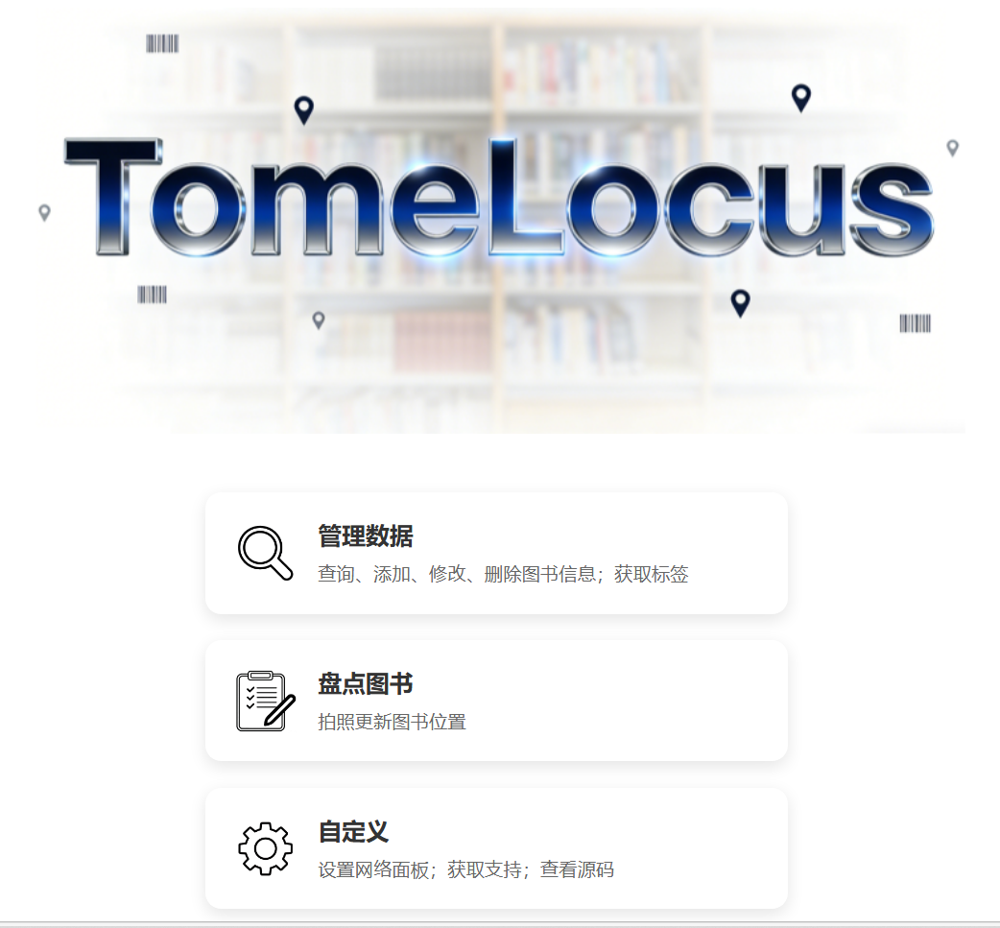
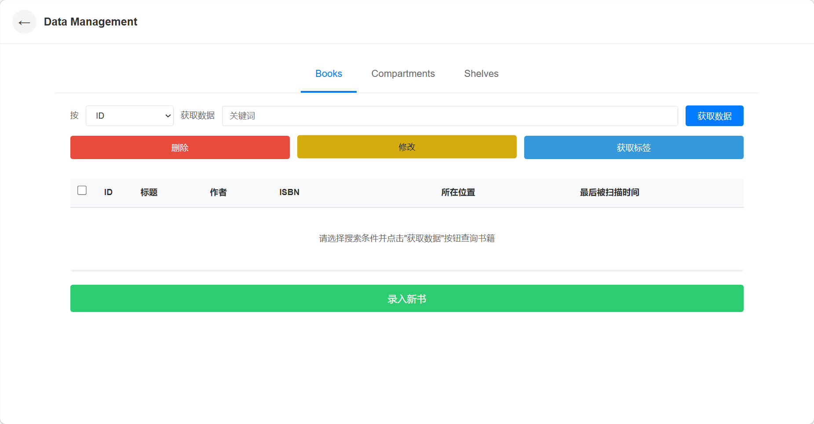
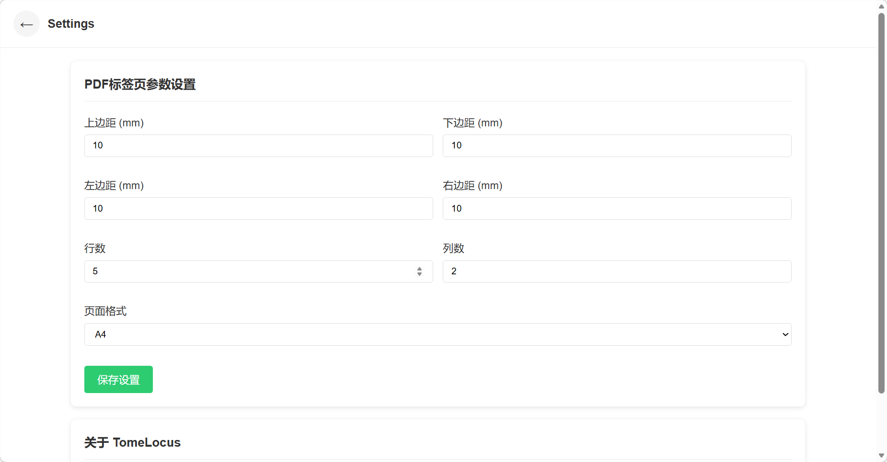
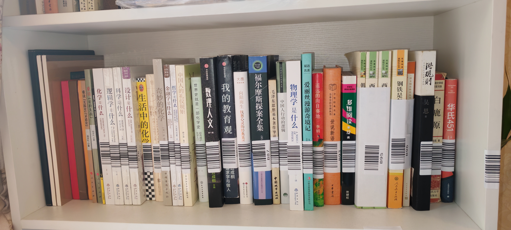
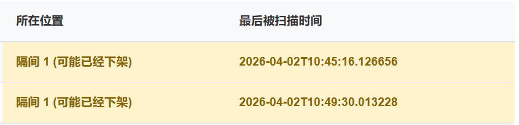

# Getting Started

## 运行环境和部署步骤
实现通过家庭局域网内的任何设备（手机、电脑、平板）浏览器访问 TomeLocus，需要把 TomeLocus 部署到家庭局域网内的“服务器”（即一个 24 小时运行的设备）上。这台“服务器”可以选择树莓派、旧电脑或支持 docker 的 NAS 设备。

如果您只是想试试 TomeLocus，也可以在您的电脑上部署，操作非常简单。

对于支持 docker 的 NAS 设备和 macOS 系统，作者暂无法提供具体步骤。

### 在 linux 系统上部署
Step 1: 检查 Python 版本，确保 >= 3.9。

```bash
python --version
```

Step 2: 下载源码发行版并解压
前往 [Releases 页面](https://gitee.com/chwu666/tome-locus/releases) 以获取最新版本链接。

```bash
wget https://gitee.com/chwu666/tome-locus/releases/download/v1.0.0/tome_locus-1.0.0.tar.gz
tar -xzvf tome_locus-1.0.0.tar.gz
cd tome_locus-1.0.0
```

Step 3: 创建虚拟环境并安装依赖

```bash
python -m venv venv
source venv/bin/activate
pip install -r requirements.txt
```

Step 4: 创建 uploads 和 temp 目录
```bash
mkdir uploads temp
```

Step 5: 运行 TomeLocus
```bash
python main.py
```

很多资料提示 linux 环境使用 pyzbar 库需要手动安装 libzbar 库，但作者在树莓派上测试时，没有安装该库也能正常解码。

### 在 Windows 系统上部署

Step 1: 检查 Python 版本，确保 >= 3.9。
```bash
python --version
```

Step 2: 下载源码发行版并解压
前往 [Releases 页面](https://gitee.com/chwu666/tome-locus/releases) 以获取最新版本。

您可以使用 [7-Zip](https://www.7-zip.org/) 解压 tar.gz 文件。

Step 3: 创建虚拟环境并安装依赖
在项目根目录打开 CMD，执行以下命令：
```bash
python -m venv venv
venv\Scripts\activate
pip install -r requirements.txt
```

Step 4: 创建 uploads 和 temp 目录
```bash
mkdir uploads temp
```

Step 5: 运行 TomeLocus
```bash
python main.py
```
## 访问 TomeLocus
在浏览器中访问 `http://<your_server_address>:8000` 即可。请开放端口 8000，若有占用，可以修改 main.py 中的端口号。
```python
# main.py 中最后三行
if __name__ == "__main__":
    import uvicorn
    uvicorn.run("main:app", host="0.0.0.0", port=8000, reload=True) # 把 port= 后面的数字修改为您需要的端口号
```

## 添加书架、隔层、图书


访问主页后，点击“管理数据”按钮，进入数据管理页面。


点击上方导航栏切换书架、隔层、图书管理页面。

**注意：数据不会自行加载，需要点击“获取数据”按钮。**

点击对应按钮可以添加、修改、删除书架、隔层、图书。

添加好后，选中所有新增的图书、隔层条目，分别点击“获取标签”按钮，下载标签图片。如果您有标签打印机，选择下载压缩包可以获得所有标签图片。若没有，可以使用模切不干胶标签纸，利用普通激光打印机打印，推荐购买 A4 尺寸，4 * 9 每张 36 个标签。根据您购买的标签纸，回到主页，点击”自定义”按钮，输入尺寸后点击保存，回到数据管理页面，选择 PDF 文档模式，即可自动下载排版好的标签。然后将打印机的纸张类型设置为标签，放入标签纸打印。



随后按下图所示粘贴标签。


将隔层标签粘贴到隔层侧壁上，图书标签粘贴到书脊上，条码应方向一致，高度一致，黑白条纹平行于水平面。

## 盘点图书
当图书位置变动时，TomeLocus 提供了拍照识别功能，来更新数据。您需要定期盘点，保证数据有效。

盘点时，使用手机对每个隔层拍照。为提高精准度，建议切换画幅为全屏，打开闪光灯，稳定手持，点击屏幕对焦后在按下快门。若书架过宽，可以在左右两侧贴上各层标签，盘点时分别拍照，系统会自动去重。参考以下示例：


拍照完成后统一上传。在主页点击：”盘点图书“按钮，点击上传图片，一次盘点中拍摄的图片一次性上传。系统会自动识别并写入数据库。

若发现上次盘点出现的图书本次盘点没有出现，系统将提示“可能已经下架”。


