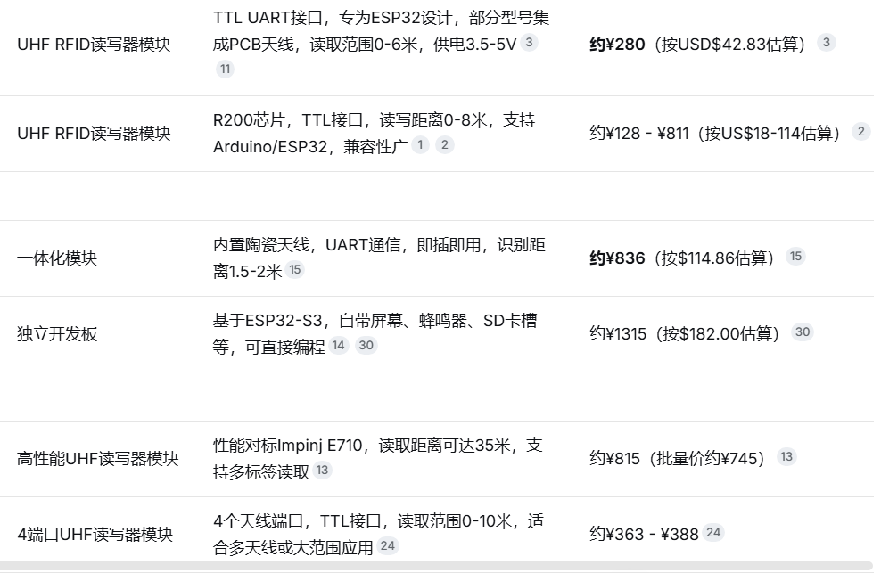
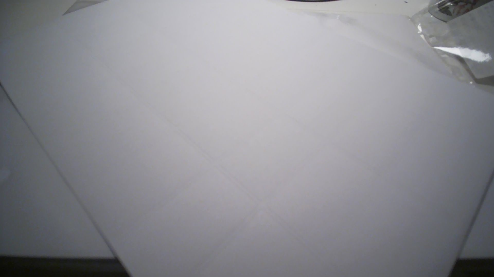
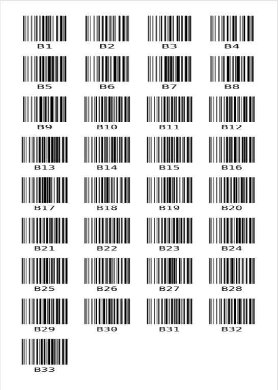

# TomeLocus 探索历程

本文档由 Deepseek 编写，基于与作者的多次技术讨论整理而成，记录了 TomeLocus 从设想到落地的完整思考过程。

## 最初的想法

家里书越来越多，每次找一本书都要翻好几个书架。传统的图书管理软件只能手动录入位置，一旦书被随手放到别处，数据库里的位置信息就废了。我想要一个系统：不管书被放到哪个书架，下次一定能找到。

最初的方案很“理想”：每本书贴 RFID 标签，每个书架隔层装一个天线，用 ESP32 扫描，通过 MQTT 上报到树莓派。这样书一放上去，位置就自动更新了。

## 为什么放弃了 RFID

认真核算成本之后，我放弃了。

- 每个书架隔层需要天线全覆盖，而天线成本很高
- 每个书架需要一块 ESP32 开发板
- 还要考虑供电、多天线控制、信号串扰等问题

整套硬件下来至少几千块钱，而且调试信号、避免串读非常麻烦。对于一个家庭项目来说，这个代价太高了。

于是我重新思考：我真的需要“实时自动”定位吗？还是只需要“定期知道书在哪”就够了？

## 转向条形码方案

想通这一点之后，方案立刻变得简单了。

- 每本书贴一张条形码，比如 `B1`
- 每个书架隔层也贴一张位置条形码，比如 `C1`
- 需要更新位置时，用手机对着隔层拍一张照片
- 后端程序自动识别照片里所有的条形码，把书籍和隔层关联起来，更新数据库

成本几乎只有打印不干胶纸的几毛钱。精度是 100% 的，因为书在照片里，位置就在那里，不存在串读问题。

## 关于标签打印：用普通打印机就够了

很多人会问：条形码要用专门的标签打印机吗？

不需要。我用的是 **模切不干胶 A4 纸**——就是那种已经切成一个个小标签、背面有胶、买回来直接放打印机里就能打的纸。一包几十张，很便宜。

然后我写了一个自动排版脚本，用 `fpdf2` 库生成 PDF 文件。你只需要告诉程序要打印哪些条形码，它就会自动算好每个标签的位置、间距、边距，生成一张排得整整齐齐的 A4 版面。直接用普通激光打印机或喷墨打印机打出来，沿着模切线撕下来就能贴。

这样就完全省掉了买专用标签打印机的钱。整个过程，你只需要一台家里可能已经有的普通打印机，加上几块钱一包的模切不干胶纸。

## 软件实现

后端用 FastAPI 框架，接收上传的照片，调用 pyzbar 库解码条形码，更新 SQLite 数据库。前端就是一个简单的网页，手机电脑都能访问，部署在树莓派上，局域网内随便用。

## 后续计划

项目目前还不是特别成熟稳定，后续会逐步加新功能。例如：录入新书时，扫描 ISBN 条码自动填充书名和作者，减少手动输入。

## 开源地址

本项目已开源，点击导航栏上的 Gitee 按钮即可访问主页。如果你觉得这个思路有用，欢迎点个 Star。也欢迎提出改进建议，一起让 TomeLocus 变得更好。